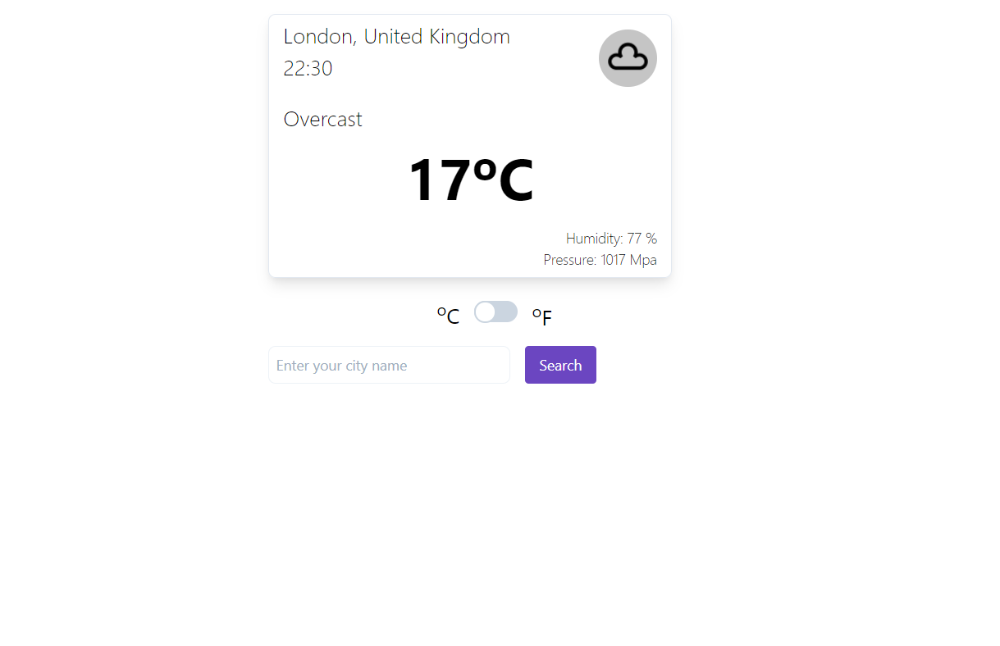

# Weather-App

> A simple weather forecast application in which user can get the details of the city by searching on it

## Built With

- HTML5
- Javascript ES6
- Tailwind

## Live Demo

[Weather-App](https://rawcdn.githack.com/shubhsk88/weather-app/938e3f39a0b8b156a080c251480422e93ad46b29/index.html)

## Setup

- Clone this repository with: `git clone https://github.com/shubhsk88/weather-app.git`
- Navigate to the project folder (weather-app) and open the `index.html` with the browser.

## 👤 Authors

👤 **Shubham Singh**

- Github: [@shubhsk88](https://github.com/shubhsk88)
- Twitter: [@shubhski](twitter.com/shubski)
- Linkedin: [linkedin](https://www.linkedin.com/in/shubhski/)

## 🤝 Contributing

Contributions, issues and feature requests are welcome!

Feel free to check the [issues page](/issues).

## Show your support

Give a ⭐️ if you like this project!
